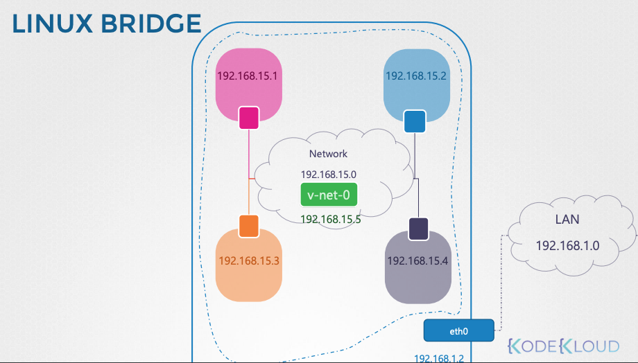

- config of CNI `/etc/cni/net.d/`
- CNI binaries `/opt/cni/bin`


# Linux Namespaces
1. create network namespaces
```bash
ip netns add red
ip netns add blue
```

2. Execute command in netns
```bash
ip netns exec NAME ip link
or
ip -n NAME link
```

3. Create virtual interface of `bridge` type (solution Linux bridge) - will be visible in host `ip a` output 
```bash
ip link add v-net-0 type bridge
```

4. Bring it `UP`
```bash
ip link set dev v-net-0 up
```

5. Create virtual links for each namespace to connect to bridge
```bash
ip link add vnet-red type veth peer name veth-red-br
ip link add vnet-blue type veth peer name veth-blue-br
```

6. Attach each link to namespace and bridge
```bash
ip link set veth-red netns red
ip link set veth-red-br master vnet-0

ip link set veth-blue netns blue
ip link set veth-blue-br master vnet-0
```

7. Assign IP address for netns
```bash
ip -n red addr add 192.168.15.1 dev veth-red
ip -n red addr add 192.168.15.2 dev veth-blue
```

8. Make interfaces `UP`
```bash
ip -n red link set veth-red up
ip -n red link set veth-blue up
```

9. Assign IP address for bridge interface
```bash
ip addr add 192.168.15.5/24 dev v-net-0
```
Now you can reach any of network napspaces IP

10. Add for each namespace default gateway to rach outside world
```bash
ip netns exec blue ip route add default via 192.168.15.5
```

11. Enable NAT on host
```bash
ip tables -t nat -A POSTROUTING -s 192.168.15.0/24 -j MASQUERADE
```




``` bash
ps aux | grep -i api
--service-cluster-ip-range=10.96.0.0/12 # service range
--ipalloc-range=10.244.0.0/16   # pod range
```